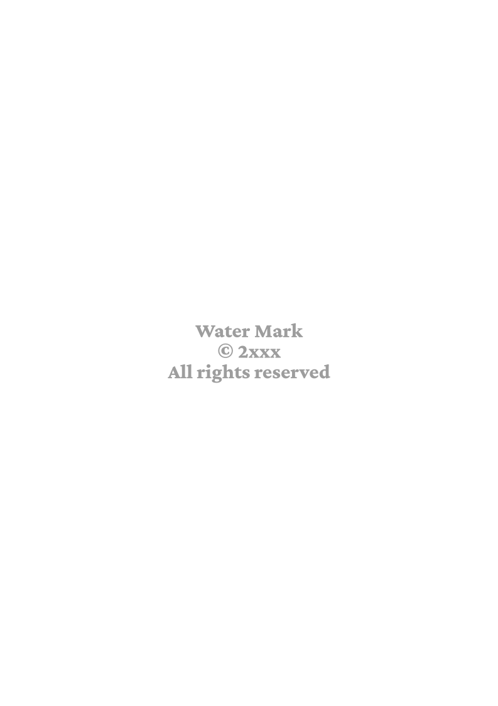

:code-snippet-dirname: code-snippet
:adoc-fragment-dirname: fragment-snippet
:images-dirname: images
:images-dir: {curr-dir-ref}/{images-dirname}
:code-snippet-dir: {curr-dir-ref}/{code-snippet-dirname}
:adoc-fragment-dir: {curr-dir-ref}/{adoc-fragment-dirname}
:title-page-background-image: none
:page-background-image: 
Author Name <author@website.com>
